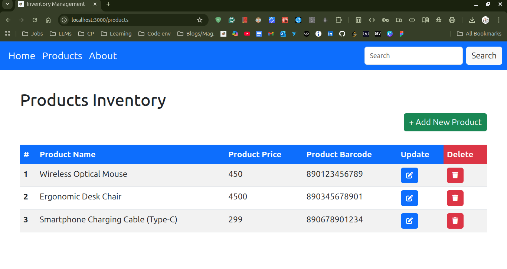

# Inventory Management App

A full-stack web application for managing product inventory. Built with Node.js/Express backend and React frontend.

## Table of Contents
- [Project Overview](#project-overview)
- [Tech Stack](#tech-stack)
- [Project Structure](#project-structure)
- [Installation](#installation)
- [Running Locally](#running-locally)
- [Features](#features)
- [Needs for Improvement](#needs-for-improvement)

## Project Overview

This inventory management application allows users to:
- View all products in the inventory
- Add new products
- Update existing products
- Delete products from inventory
- Navigate through different sections of the app

## App Preview



## Tech Stack

**Frontend:**
- React
- CSS3
- React Router (implied from component structure)

**Backend:**
- Node.js
- Express.js
- Database (MongoDB or similar - configured in db.js)

## Project Structure

```
inventory-management-app/
├── frontend/                 # React frontend application
│   ├── public/
│   │   ├── index.html
│   │   ├── manifest.json
│   │   └── robots.txt
│   ├── src/
│   │   ├── components/       # React components
│   │   │   ├── About.js
│   │   │   ├── Home.js
│   │   │   ├── InsertProduct.js
│   │   │   ├── Navbar.js
│   │   │   ├── Products.js
│   │   │   └── UpdateProduct.js
│   │   ├── App.js
│   │   ├── App.css
│   │   ├── index.js
│   │   └── index.css
│   └── package.json
│
└── backend/                  # Node.js/Express backend
    ├── index.js              # Main server file
    ├── db.js                 # Database configuration
    ├── package.json
    ├── Models/
    │   └── Products.js       # Product model
    └── Routes/
        └── router.js         # API routes
```

## Installation

### Prerequisites
- Node.js (v14 or higher)
- npm or yarn
- MongoDB (if using MongoDB)

### Backend Setup

1. Navigate to the backend directory:
```bash
cd backend
```

2. Install dependencies:
```bash
npm install
```

3. Configure your database connection in `db.js`

4. (Optional) Create a `.env` file for environment variables:
```
MONGODB_URI=your_database_connection_string
PORT=5000
```

### Frontend Setup

1. Navigate to the frontend directory:
```bash
cd frontend
```

2. Install dependencies:
```bash
npm install
```

## Running Locally

### Start Backend Server

1. From the `backend` directory:
```bash
npm start
```
- The backend server will run on `http://localhost:5000` (or the port specified in your configuration)

### Start Frontend Development Server

1. In a new terminal, navigate to the `frontend` directory:
```bash
cd frontend
```

2. Start the development server:
```bash
npm start
```
- The frontend will open at `http://localhost:3000`

### Access the Application

Open your browser and navigate to:
```
http://localhost:3000
```

The app should now be fully functional with the frontend communicating with the backend API.

## Features

- **Dashboard/Home:** View inventory overview
- **Products Page:** Display all products in the inventory
- **Add Product:** Insert new products into the inventory
- **Update Product:** Modify existing product details
- **Navigation Bar:** Easy navigation between different sections
- **About Page:** Information about the application

## Needs for Improvement

### Priority 1 (High)
- **API Error Handling:** Implement comprehensive error handling and validation on both frontend and backend
- **Authentication & Authorization:** Add user login/logout functionality and role-based access control
- **Input Validation:** Implement client-side and server-side validation for product data
- **Database Optimization:** Add indexing and query optimization for better performance
- **Environment Configuration:** Use proper environment variable management (.env files)

### Priority 2 (Medium)
- **UI/UX Improvements:** 
  - Add loading indicators and spinners
  - Implement toast notifications for user feedback
  - Improve responsive design for mobile devices
- **Search & Filter:** Add search, filter, and sort functionality for products
- **Pagination:** Implement pagination for large product lists
- **Product Images:** Add support for product images/thumbnails
- **Delete Confirmation:** Add confirmation dialog before deleting products

### Priority 3 (Low)
- **Testing:** Add unit tests and integration tests
- **Documentation:** Create API documentation (Swagger/OpenAPI)
- **Logging:** Implement application logging system
- **Caching:** Add Redis caching for frequently accessed data
- **Deployment:** Containerize with Docker and deploy to cloud platform
- **Performance Monitoring:** Add performance monitoring and analytics
- **Dark Mode:** Implement dark mode theme option


---
